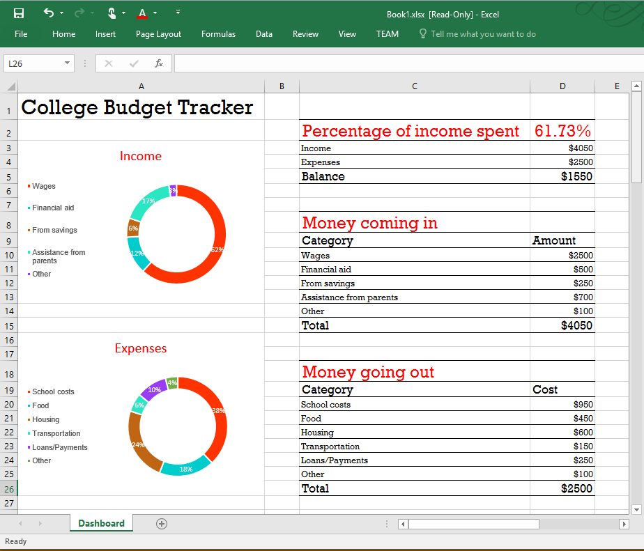
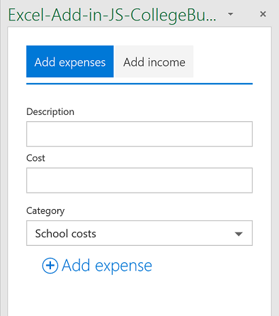

# Ejemplo del complemento del panel de tareas del rastreador de presupuestos universitarios para Excel 2016

_Se aplica a: Excel 2016_

Este complemento del panel de tareas muestra cómo crear un rastreador de presupuestos universitarios con las API de JavaScript de Excel 2016. Hay dos tipos: editor de código y Visual Studio.

## Pruébelo
### Versión del editor de código

La forma más sencilla de implementar y probar el complemento consiste en copiar el manifiesto en un recurso compartido de red.

1.  Cree una carpeta en un recurso compartido de red (por ejemplo, \\MiRecursoCompartido\RastreadorPresupuestosUniversitarios).  
2.  Copie el manifiesto (CollegeBudgetTrackerManifest.xml) en un recurso compartido de red (por ejemplo, \\\MiRecursoCompartido\\MisManifiestos).
3.  Agregue la ubicación del recurso compartido que contiene el manifiesto como un catálogo de aplicaciones de confianza en Excel.

    a. Inicie Excel y abra una hoja de cálculo en blanco.  
    
    b. Seleccione la pestaña **Archivo** y haga clic en **Opciones**.
    
    c. Haga clic en **Centro de confianza** y seleccione el botón **Configuración del Centro de confianza**.
    
    d. Elija **Catálogos de complementos de confianza**.
    
    e. En el cuadro **URL de catálogo**, escriba la ruta de acceso al recurso compartido de red que creó en el paso 3 y luego elija **Agregar catálogo**.
    
   f. Active la casilla **Mostrar en el menú** y elija **Aceptar**. Aparecerá un mensaje para informarle de que la configuración se aplicará la próxima vez que inicie Office. 
        
4.  Pruebe y ejecute el complemento. 

    a. En la pestaña **Insertar** de Excel 2016, elija **Mis complementos**. 
    
    b. En el cuadro de diálogo **Complementos de Office**, seleccione **Carpeta compartida**.
    
    c. Haga clic en el comando **Seguimiento de presupuesto universitario** de la pestaña Inicio. El complemento se abrirá en un panel de tareas y creará el seguimiento del presupuesto universitario en la hoja activa, tal como se muestra en el diagrama. 
      
    

    d. Agregue algunos gastos e ingresos mediante las pestañas **Agregar gastos** y **Agregar ingresos** y vea cómo cambian dinámicamente los datos y los gráficos.
    
       

Para usar el manifiesto en su propio complemento, edite el elemento <SourceLocation> del archivo de manifiesto para que apunte a la ubicación del recurso compartido del archivo Home.html.
    
### Versión de Visual Studio
1.  Copie el proyecto en una carpeta local y abra Excel-Add-in-JS-CollegeBudgetTracker.sln en Visual Studio.
2.  Pulse F5 para crear e implementar el complemento de ejemplo. Excel se inicia y se abre el complemento en un panel de tareas a la derecha de una hoja de cálculo en blanco, como se muestra en la siguiente ilustración. 
        
   

3.  Agregue algunos gastos e ingresos mediante las pestañas **Add expenses** (Agregar gastos) y **Add income** (Agregar ingresos) y vea cómo cambian dinámicamente los datos y los gráficos.

   

### Obtener más información

Las API de JavaScript de Excel tienen mucho que ofrecer para el desarrollo de complementos. A continuación se muestran algunos de los recursos disponibles. 

1.  [Introducción a la programación de complementos de Excel](https://github.com/OfficeDev/office-js-docs/blob/master/excel/excel-add-ins-programming-overview.md)
2.  [Explorador de fragmentos de código para Excel](http://officesnippetexplorer.azurewebsites.net/#/snippets/excel)
3.  [Ejemplos de código de complementos de Excel](https://github.com/OfficeDev/office-js-docs/blob/master/excel/excel-add-ins-code-samples.md) 
4.  [Referencia de la API de JavaScript de complementos de Excel](https://github.com/OfficeDev/office-js-docs/blob/master/excel/excel-add-ins-javascript-reference.md)
5.  [Compilar el primer complemento de Excel](https://github.com/OfficeDev/office-js-docs/blob/master/excel/build-your-first-excel-add-in.md)
