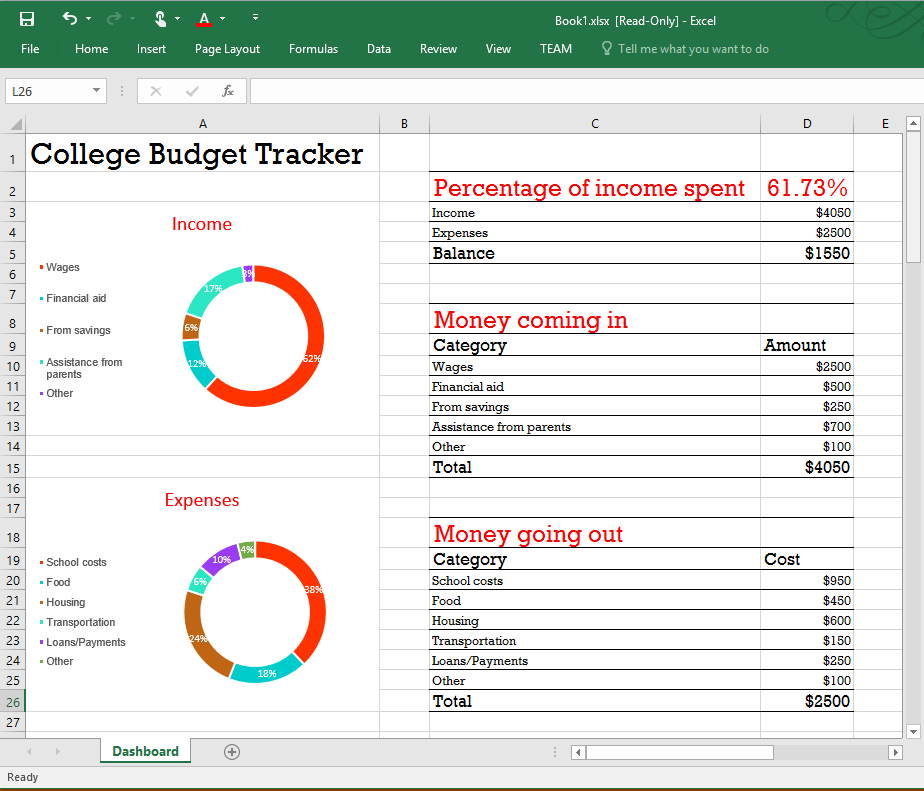

# Excel 2016 用の大学予算追跡ツール作業ウィンドウ アドインのサンプル

_適用対象: Excel 2016_

この作業ウィンドウ アドイン アドインには、Excel 2016 の JavaScript API を使用して大学予算追跡ツールを作成する方法が示されます。コード エディターと Visual Studio のいずれかを選択できます。

## お試しください。
### コード エディターのバージョン

アドインを展開してテストする最も簡単な方法は、マニフェストをネットワーク共有にコピーすることです。

1.  ネットワーク共有 (たとえば \\\MyShare\CollegeBudgetTracker) にフォルダーを作成します。  
2.  マニフェスト (CollegeBudgetTrackerManifest.xml) をネットワーク共有 (たとえば \\\MyShare\MyManifests) にコピーします。
3.  マニフェストを格納する共有の場所を、Excel で信頼されるアプリ カタログとして追加します。

    a.Excel を起動し、空のスプレッドシートを開きます。  
    
    b.**[ファイル]** タブを選択し、**[オプション]** を選択します。
    
    c.**[セキュリティ センター]** を選択し、**[セキュリティ センターの設定]** ボタンを選択します。
    
    d.**[信頼できるアドイン カタログ]** を選択します。
    
    e.**[カタログの URL]** ボックスで、手順 3 で作成したネットワーク共有のパスを入力し、**[カタログの追加]** を選択します。
    
   f. **[メニューに表示する]** チェック ボックスをオンにしてから **[OK]** を選択します。これらの設定は Office を次回起動したときに適用されることを示すメッセージが表示されます。 
        
4.  アドインをテストし、実行します。 

    a.Excel 2016 の **[挿入]** タブで、**[個人用アドイン]** を選択します。
    
    b.**[Office アドイン]** ダイアログ ボックスで、**[共有フォルダー]** を選択します。
    
    c.**[ホーム]** タブの **[大学予算の追跡ツール]** をクリックします。 アドインが作業ウィンドウで開き、次の図に示すように、作業中のシートで大学予算の追跡ツールが作成されます。 
      
    

    d.**[経費の追加]** タブと **[収入の追加]** タブを使用して経費や収入を追加し、データとグラフがどのように動的に変化するかを確認します。
    
       

独自のアドインでマニフェストを使用するには、マニフェスト ファイルの <SourceLocation> 要素を編集して、この要素が Home.html ファイルの共有場所を指すようにします。
    
### Visual Studio のバージョン
1.  プロジェクトをローカル フォルダーにコピーし、Visual Studio で Excel-Add-in-JS-CollegeBudgetTracker.sln を開きます。
2.  F5 キーを押して、サンプル アドインをビルドおよび展開します。Excel が起動し、次の図に示すように、空白のワークシートの右側の作業ウィンドウでアドインが開きます。 
        
   

3.  **[経費の追加]** と **[収入の追加]** タブを使用して経費や収入を追加し、データとグラフがどのように動的に変化するかを確認します。

   

### 詳細を見る

アドインを開発する際に Excel JavaScript API でできることは他にも数多くあります。以下は、利用可能なリソースのほんの一例です。 

1.  [Excel アドインのプログラミングの概要](https://github.com/OfficeDev/office-js-docs/blob/master/excel/excel-add-ins-programming-overview.md)
2.  [Excel のスニペット エクスプローラー](http://officesnippetexplorer.azurewebsites.net/#/snippets/excel)
3.  [Excel アドインのコード サンプル](https://github.com/OfficeDev/office-js-docs/blob/master/excel/excel-add-ins-code-samples.md) 
4.  [Excel アドインの JavaScript API リファレンス](https://github.com/OfficeDev/office-js-docs/blob/master/excel/excel-add-ins-javascript-reference.md)
5.  [初めての Excel アドインを作成する](https://github.com/OfficeDev/office-js-docs/blob/master/excel/build-your-first-excel-add-in.md)
