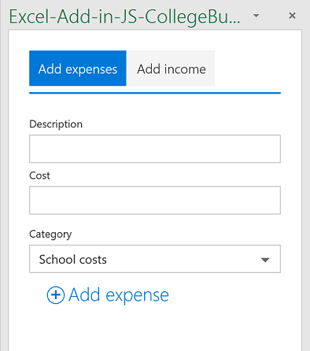

# 适用于 Excel 2016 的大学预算跟踪程序任务窗格外接程序示例

_适用于：Excel 2016_

此任务窗格外接程序介绍如何在 Excel 2016 中使用 JavaScript API 创建大学预算跟踪程序。它有两种类型：代码编辑器和 Visual Studio。

## 尝试一下
### 代码编辑器版本

部署和测试外接程序最简单的方法是将清单复制到网络共享。

1.  在网络共享上创建一个文件夹（如 \\\MyShare\CollegeBudgetTracker）。  
2.  将清单 (CollegeBudgetTrackerManifest.xml) 复制到网络共享（例如 \\\MyShare\\MyManifests）。
3.  添加将清单作为 Excel 中受信任的应用目录的共享位置。

    a.启动 Excel 并打开一个空白的电子表格。  
    
    b.选择**文件**选项卡，然后选择**选项**。
    
    c.选择**信任中心**，然后选择**信任中心设置**按钮。
    
    d.选择**受信任的外接程序目录**。
    
    e.在**目录 Url**框中，输入在第 3 步中创建的网络共享的路径，然后选择**添加目录**。
    
   f.  选中“**显示在菜单中**”复选框，然后选择“**确定**”。此时，系统会显示一条消息，提醒你注意你的设置将在 Office 下次启动时应用。 
        
4.  测试并运行外接程序。 

    a.在 Excel 2016 的**插入选项卡**中，选择**我的外接程序**。
    
    b.在**Office 外接程序**对话框中，选择**共享文件夹**。
    
    c.单击主页选项卡中的**大学预算跟踪器**命令。 外接程序在任务窗格中打开，并在活动工作表中创建大学预算跟踪器，如此图中所示。 
      
    

    d.使用**添加支出**和**添加收入**选项卡添加一些支出和收入，并查看数据和图表如何动态地更改。
    
       

若要使用你自己的外接程序中的清单，编辑清单文件的 <SourceLocation> 元素，使其指向你的 Home.html 文件的共享位置。
    
### Visual Studio 版本
1.  将项目复制到本地文件夹，并在 Visual Studio 中打开 Excel-Add-in-JS-CollegeBudgetTracker.sln。
2.  按 F5 生成并部署示例外接程序。Excel 启动并且外接程序会在空白工作簿右侧的任务窗格中打开，如下图所示。 
        
   

3.  使用“**添加支出**”和“**添加收入**”选项卡添加一些支出和收入，并查看数据和图表如何动态地更改。

   

### 了解详细信息

在您开发外接程序时，Excel JavaScript API 可以提供更多功能。下面只是其中一些可用资源。 

1.  [Excel 外接程序编程概述](https://github.com/OfficeDev/office-js-docs/blob/master/excel/excel-add-ins-programming-overview.md)
2.  [适用于 Excel 的代码段资源管理器](http://officesnippetexplorer.azurewebsites.net/#/snippets/excel)
3.  [Excel 外接程序代码示例](https://github.com/OfficeDev/office-js-docs/blob/master/excel/excel-add-ins-code-samples.md) 
4.  [Excel 外接程序 JavaScript API 参考](https://github.com/OfficeDev/office-js-docs/blob/master/excel/excel-add-ins-javascript-reference.md)
5.  [构建你的第一个 Excel 外接程序](https://github.com/OfficeDev/office-js-docs/blob/master/excel/build-your-first-excel-add-in.md)
